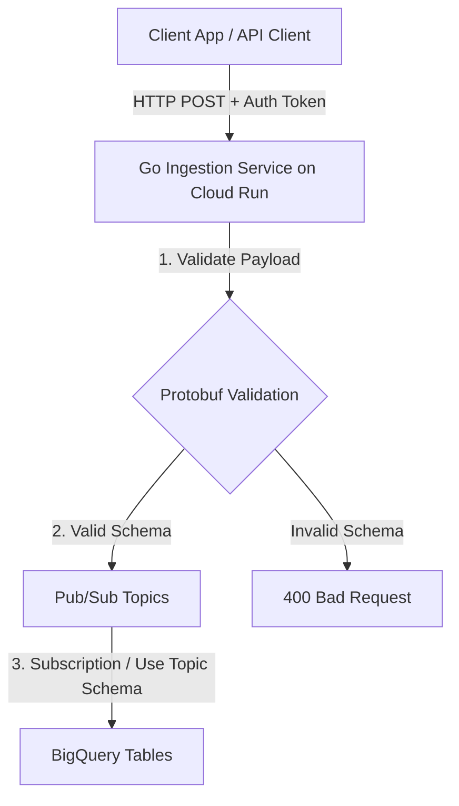

# GCP Data Platform Ingestion Pipeline

A serverless, real-time, schema-enforced event ingestion pipeline built on Google Cloud Platform (GCP). It enables applications to ingest high-throughput events securely, validates them against strict Protobuf definitions at the edge, and streams them into BigQuery for analytics.

---

## 1. What is this Project?

This repository contains the code and infrastructure definitions for a scalable event ingestion pipeline:



It consists of three decoupled components:
1. **[schema-managment](file:///usr/local/google/home/benmizrahi/gcp-data-platfrorm/schema-managment/)**: Dynamic API contract definition using **Protobuf** and **Buf**. It acts as the single source of truth for events, generating both Go stubs for the service and JSON schemas for BigQuery.
2. **[ingestion-service](file:///usr/local/google/home/benmizrahi/gcp-data-platfrorm/ingestion-service/)**: A lightweight, high-performance Go web service deployed on **Cloud Run**. It exposes a unified endpoint, authenticates requests, parses payloads using Proto schemas, and publishes valid events to Google Pub/Sub.
3. **[pipeline-infrastrcture](file:///usr/local/google/home/benmizrahi/gcp-data-platfrorm/pipeline-infrastrcture/)**: **Terraform** configurations to provision GCP Pub/Sub topics, Pub/Sub schemas, BigQuery datasets and tables, IAM bindings, and Cloud Run services.

---

## 2. Why is it Needed?

Modern data lakes and data warehouses suffer from **"dirty data"**—unstructured, malformed, or missing fields that break downstream ETL pipelines and analytics. 

This platform solves this challenge by enforcing **schemas at the ingestion boundary**:
* **Contract-First Development**: API schemas are defined using Protocol Buffers. Client apps and backend systems must adhere strictly to these types.
* **Double-Layer Validation**: 
  - The Go Ingestion Service validates request payloads before pushing to Pub/Sub.
  - Pub/Sub enforces its own native schema registry matching the Protobuf contracts, ensuring no malformed messages can ever enter the streaming queue.
* **Auto-Generated Target Schemas**: BigQuery tables are created automatically using BigQuery JSON schemas generated directly from the same Protobuf source. No manual mapping is required.
* **Zero Operations Overhead**: Built entirely on Google Cloud Run, Pub/Sub, and BigQuery, scaling automatically from zero to thousands of requests per second.

---

## 3. Key Use Cases

* **Application Event Analytics**: Tracking user interactions, logins, and progression states in real-time.
* **Transactional Logs & Auditing**: Storing secure purchase and commerce events with a strict audit trail.
* **Edge IoT / Device Telemetry**: Accepting high-velocity payload updates from client apps and edge devices.
* **Decoupled Event-Driven Architectures**: Serving as a gateway that fans out verified events to multiple downstream microservices (e.g. databases, notification engines, search indexing).

---

## 4. Codebase Structure

```
gcp-data-platfrorm/
├── Makefile                     # Root build and deployment orchestrator
├── .gcloudignore                # Configures source upload exclusions for Cloud Build
├── go.work                      # Multi-module Go workspace file
├── schema-managment/            # Event schema contract definitions
│   ├── proto/                   # Protobuf source files (.proto)
│   ├── gen/                     # Auto-generated code (Go stubs and BigQuery JSONs)
│   └── buf.yaml                 # Buf schema configuration
├── ingestion-service/           # Go HTTP ingestion microservice
│   ├── Dockerfile               # Multistage container configuration
│   ├── cloudbuild.yaml          # Google Cloud Build instructions
│   └── main.go                  # Service router, auth handler, and Pub/Sub publisher
└── pipeline-infrastrcture/      # Infrastructure-as-Code definitions
    ├── main.tf                  # Resources (Pub/Sub, BigQuery, IAM, Cloud Run)
    ├── variables.tf             # Inputs (project, environment, token configuration)
    └── outputs.tf               # Live endpoints and resource identifiers
```

---

## 5. Quick Start & Deployment

### Prerequisites
* [Google Cloud SDK (gcloud CLI)](https://cloud.google.com/sdk/docs/install)
* [Terraform >= 1.3.0](https://developer.hashicorp.com/terraform/downloads)
* [Buf CLI](https://buf.build/docs/installation)

### Local Schema Compilation
To generate/update the Go stubs and BigQuery table schemas:
```bash
make generate
```

### Complete Cloud Deployment
To compile schemas, build and push the container image to Google Cloud Build, and provision all resources via Terraform:
```bash
make deploy PROJECT_ID=catchme-poc INGESTION_API_TOKEN=data123
```

### Retrieving the Ingestion Service URL
After a successful deployment, the URL of the ingestion service is printed in the terminal as `ingestion_service_url`.

You can also retrieve it at any time using:
* **Via Terraform Outputs**:
  ```bash
  cd pipeline-infrastrcture
  terraform output -raw ingestion_service_url
  ```
* **Via Google Cloud CLI (gcloud)**:
  ```bash
  gcloud run services describe dev-platform-ingestion \
    --region=us-central1 \
    --format='value(status.url)' \
    --project your-gcp-project-id
  ```

---

## 6. API Token & Environment Configuration

The Ingestion Service validates client requests using a secure API Token.

### A. Local Development Only (`.env` file)
> [!IMPORTANT]
> The `.env` file is strictly for **local development and testing**. It is pre-configured in `.gitignore` and must **never** be committed to git or used for production configurations.

To run or test the ingestion service locally, configure a `.env` file inside the `ingestion-service/` directory:

1. Create or edit the `ingestion-service/.env` file:
   ```env
   # GCP Project ID where the Pub/Sub topics are hosted
   GOOGLE_CLOUD_PROJECT=your-gcp-project-id

   # Port configuration
   PORT=8080
   GRPC_PORT=50051

   # Secret API Ingestion Token
   # Shared secret between client applications and this ingestion gateway.
   INGESTION_API_TOKEN=your-secure-token-here

   # Pub/Sub Topic Mappings
   PUBSUB_TOPIC_LOGIN=dev-platform-login
   PUBSUB_TOPIC_LEVEL=dev-platform-level
   PUBSUB_TOPIC_TRANSACTION=dev-platform-transaction
   ```

### B. Production Deployment (Terraform Secrets)
For Google Cloud Run, the `INGESTION_API_TOKEN` is injected as a container environment variable by Terraform. 

To configure your secret production token safely:
1. Create a `terraform.tfvars` file in the `pipeline-infrastrcture/` directory (this file is pre-configured in `.gitignore` so it won't be committed to source control):
   ```hcl
   project_id          = "your-gcp-project-id"
   ingestion_api_token = "your-secure-production-token-here"
   ```
2. Run your deployment command passing the token as a parameter:
   ```bash
   make deploy PROJECT_ID=catchme-poc INGESTION_API_TOKEN=data123
   ```

---

## 7. How to Ingest Events (API Examples)

The ingestion service URL can be fetched from Terraform output (`ingestion_service_url`). Use the Authorization header with your `INGESTION_API_TOKEN` (e.g., `data123`).

### 1. Ingest a Login Event
```bash
curl -X POST https://dev-platform-ingestion-k4oohmjbaa-uc.a.run.app/api/v1/events \
  -H "Content-Type: application/json" \
  -H "Authorization: Bearer data123" \
  -d '{
    "event_name": "user.login",
    "source": "curl-test",
    "user_id": "user_98765",
    "method": "LOGIN_METHOD_EMAIL",
    "success": true,
    "ip_address": "127.0.0.1",
    "user_agent": "curl/8.0.0"
  }'
```

### 2. Ingest a Level Progression Event
```bash
curl -X POST https://dev-platform-ingestion-k4oohmjbaa-uc.a.run.app/api/v1/events \
  -H "Content-Type: application/json" \
  -H "Authorization: Bearer data123" \
  -d '{
    "event_name": "level.progression",
    "source": "curl-test",
    "user_id": "user_98765",
    "level_id": "stage_1_boss",
    "action": "LEVEL_ACTION_COMPLETED",
    "score": 5200,
    "duration_seconds": 120
  }'
```

### 3. Ingest a Transaction Event
```bash
curl -X POST https://dev-platform-ingestion-k4oohmjbaa-uc.a.run.app/api/v1/events \
  -H "Content-Type: application/json" \
  -H "Authorization: Bearer data123" \
  -d '{
    "event_name": "commerce.purchase",
    "source": "curl-test",
    "user_id": "user_98765",
    "transaction_id": "tx_abc123",
    "amount": 24.99,
    "currency": "USD",
    "items": [
      {
        "item_id": "item_1",
        "name": "Power-up Pack",
        "price": 24.99,
        "quantity": 1
      }
    ],
    "status": "TRANSACTION_STATUS_SUCCESS"
  }'
```

---

## Disclaimer

This is not an officially supported Google product.